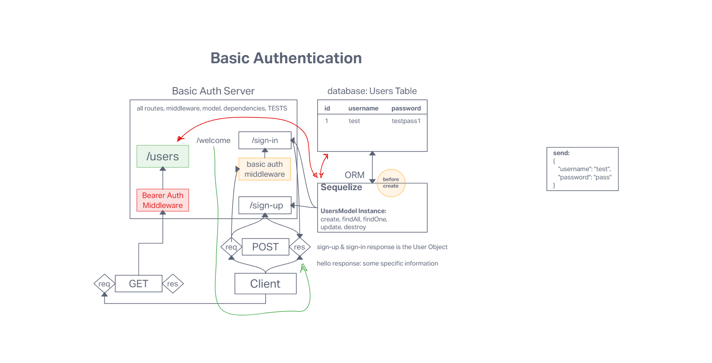

# Project: Basic Auth

## Author: Tyler Main

### Code 401d48 Lab 06

### Problem Domain

Deploy an Express server that implements Basic Authentication, with signup and signin capabilities, using a Postgres database for storage.

### Setup

### Running the application locally

- Clone the repository to your local machine, then run the following commands in your terminal -

  npm install
  touch .env

- Add the following lines to the newly created .env file.

PORT=<port number>

- Run the following command -

  npm start

- You can now access the application in your browser by navigating to https://localhost:PORT, with PORT being the port number that you specified in the .env.

#### Endpoints

##### Endpoint: /

Response: The server works!

##### Endpoint: /bad

Returns JSON Object
  {
    "error": 500,
    "route": "/bad",
    "query": {},
    "message": "Bad endpoint"
  }

#### Tests

- Unit Tests: npm run test

#### Include testing to assert the following

- 404 on a bad route

- 404 on a bad method

- creates a user with POST

### Dependencies

- base-64
- bcrypt
- node
- dotenv
- express
- jest
- supertest
- sequelize
- sequelize-cli
- pg
- sqlite3

### UML

